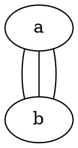
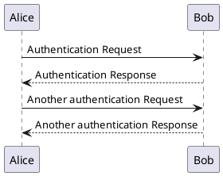

我极度厌恶拖拽式的图形界面，一方面是因为我最常使用的光标输入设备是 MacBook 自带的触控板，而众所周知用触控板拖拽简直是世界上最反人类的操作；另一方面，对于不少操作，图形界面都是不必要且更消耗资源的。开发者要构建图形界面，需要花更多的时间分析、设计和编码；电脑要运行图形界面，需要占用更多的系统资源；磁盘上存储图形数据，占用的空间也更高。诚然，图形界面的优势是简单直观、使用门槛低，但如果你有一个纯文本编辑器、习惯或愿意尝试使用命令行、乐意探索新技术，那么，我认为你至少应该尝试用纯文本的解决方案，替代原有的图形界面解决方案。<!--more-->

本文整理了几种在我看来使用纯文本解决要比使用图形界面解决来得更方便、更高效的问题场景，并给出了用到的相关软件，供读者参考。

## 绘图

作为软件工程的学生，画各种流程图、活动图、时序图和用例图应该是家常便饭。在软件工程里，表达需求的方式有很多种：自然语言描述、伪代码描述，还有图表。其中，图表自然是最清晰直观的，是必要的沟通工具。

在软件工程领域，各种类型的图表都有相应的规范。最常见的规范就是 UML，全称 Unified Modeling Language（统一建模语言），它提供了描述软件系统架构、行为和需求的标准。

相关的绘图工具有很多，这里不谈国内外的各种 SaaS 软件[^1]，笔者在以前最长使用的是开源免费的 [draw.io](https://draw.io/)，基于 Web。使用这类基于图形界面的软件绘图的基本流程是：在左侧长长的列表中中到你需要的图形，然后把它拖拽到中间，点击它，把手指的位置从鼠标移动的键盘上，然后输入文本，然后把手指的位置从键盘移动到鼠标上，拖拽另一个图形到中间…… 在之后，你还要手动调整这些图形是否对齐、间距是否合适。

在这个过程中，有不少时间都浪费在了调整图形上，而不是用在「传达信息」上。而且，可供选择的图形种类很多，用户完全有可能用错图形，画出不符合 UML 规范的图。

有一段时间我会用自然语言描述需求，然后用 LLM 生成 SVG 代码来画图，但 LLM 的空间想象能力为 0，画出来的图歪七扭八，根本没法用。后来我发现，基于纯文本的画图解决方案其实不少。

### Mermaid

你可以把 [Mermaid](https://mermaid.js.org/) 想象成用来画图的 Markdown。要画一个简单的流程图（Flowchart），你只需要这样写：


Mermaid 的优势是，它和 Markdown 的生态系统兼容性很好，很多 Markdown 编辑器和渲染工具，都能够渲染嵌入在代码块里的 Mermaid 图形，你只需要把代码块的语言指定为 `mermaid`， 这个代码块就会被替换为图形。据我所知，Obsidian 是内置这个功能的，而 Hugo 的官方[文档](https://gohugo.io/content-management/diagrams/#mermaid-diagrams)里也提供了在 Hugo 中使用 Mermaid 的教程。

Mermaid 提供 [JavaScript 库](https://github.com/mermaid-js/mermaid)和[命令行工具](https://github.com/mermaid-js/mermaid-cli)，可以轻易地在网站上使用、在基于 Web 的桌面端软件里使用，或者在本地用纯文本编写，再执行 `mmdc` 命令讲文本转换为指定格式的图形。

不过，我并没有继续使用 Mermaid，因为它有一个非常明显的缺陷：Mermaid 并不支持完整的 UML 规范。尽管 Mermaid 支持很多类型的图形（甚至包括思维导图、看板、饼图和四象限图），但缺少对用例图、活动图等重要 UML 图的支持。

顺带一提，早在 2023 年七月，就有一个相关的 [Issue](https://github.com/mermaid-js/mermaid/issues/4628) 被提出，建议添加用例图，有超过 600 点赞，呼声不小。也有 [Pull Request](https://github.com/mermaid-js/mermaid/pull/6141) 被提出，没有被合并[^3]，而且这个 PR 也没有完整实现规范的用例图，缺乏拓展、包含等关系的表示。Issue 的状态被标记为 Approved（通过），但用例图一直没有被添加到 Mermaid 中。Mermaid 上一次添加新的图表类型是在 [v11.0.0](https://github.com/mermaid-js/mermaid/releases/tag/v11.0.0) 版本[^2]，一年前。毕竟是开源项目，缺乏人手添加新功能也是可以理解的，而且 Mermaid 的定位是创建图表和可视化内容的，并非是对 UML 的实现。

### Graphviz

[Graphviz](https://graphviz.org/) 是上个世纪就出现的绘图软件，使用名为 DOT 的语言绘制节点、边、图、子图和组，支持命令行。Graphviz 的语法和 Mermaid 类似，但无需指定图表类型，因为 Graphviz 没有图表类型这个说法。个人感觉，Graphviz 中的 Graph 就是指数据结构中的图（graph），而不是图表（diagram）。



Graphviz 是用 C 写的，速度应该会比用 TypeScript 编写的 Mermaid 要更快，但不适合集成在 Web 应用中。如果需要表示数据结构，Graphviz 大概会更合适。

### PlantUML

[PlantUML](https://plantuml.com/) 基本上就是对 UML 的实现，支持时序图、用例图、类图、对象图、活动图等等。如果要画符合规范的 UML 图，PlantUML 几乎是最好的选择。除此之外，PlantUML 还支持不少非 UML 图，比如项目管理相关的甘特图和 WBS[^4] 图，还有数据库相关的 E-R 图[^5]。

PlantUML 的语法会稍微繁杂一点，~~原因大概是 PlantUML 是用 Java 写的，所以继承了编程语言的啰嗦特性~~，但整体上还算简单。以下是一个时序图的例子：



*Bob 和 Alice 简直是软件领域的李华。*

要使用 PlantUML，可以使用官方提供的[在线编辑器](https://www.plantuml.com/plantuml/uml/SyfFKj2rKt3CoKnELR1Io4ZDoSa70000)，也可以[下载](https://plantuml.com/download)到自己的电脑上，然后运行 JAR 文件——是的，你需要安装 Java……

```sh
java -jar plantuml.jar input.txt
```

我的建议是在 `.zshrc`（或者其他终端的配置文件里）给这个命令设置一个别名，这样就不需要每次都找到 JAR 文件在哪了。

PlantUML 也有相关的集成插件，可以在*万恶的* IntelliJ IDEA、VS Code 等编辑器中使用，也可以用在支持拓展语法的 Markdown 里。我自己最常用的场景是用 Pandoc 输入 Markdown 生成 PDF，可以使用这个 [pandoc-plantuml-filter](https://github.com/timofurrer/pandoc-plantuml-filter) 让 Pandoc 渲染通过代码块嵌入在 Markdown 文件中的 PlantUML 图。

## 富文本编辑

Word 简直是世界上最反人类的文本编辑器，还有与之相关的 Pages[^6] 和国内的 WPS——明明论文格式和各种文档都有固定的格式要求，我为什么会需要每写一篇文档都要手动调整格式，在各个菜单栏里点来点去？就算用格式刷我也觉得很难受！

### LaTeX

目前最成熟的文档标记语言应该是 [LaTeX](https://www.latex-project.org/)，这是一个免费软件。以下是 LaTeX 官网上引言的片段：

> LaTeX 不是一个文本处理器！相反，LaTeX 鼓励作者们不要太担心文档的外观，而是专注在编写正确的内容上。举个例子，考虑这篇文档：
> 
> ```text
> Cartesian closed categories and the price of eggs
> Jane Doe
> September 1994
> 
> Hello world!
> ```
> 
> 要在大部分排字或文本处理系统里产出这个文本，作者不得不决定使用什么排版，所以要选择（比如说）18 pt 大小的 Times Roman 字体用在标题上，12 pt 大小的 Times Italic 字体用在名字上，等等。这会导致两个结果：作者把时间浪费在了设计上；还有很多设计得不好的文档！

<details>
	<summary>原文</summary>
	
> LaTeX is not a word processor! Instead, LaTeX encourages authors not to worry too much about the appearance of their documents but to concentrate on getting the right content. For example, consider this document:
> 
> ```text
> Cartesian closed categories and the price of eggs
> Jane Doe
> September 1994
> 
> Hello world!
> ```
>
> To produce this in most typesetting or word-processing systems, the author would have to decide what layout to use, so would select (say) 18pt Times Roman for the title, 12pt Times Italic for the name, and so on. This has two results: authors wasting their time with designs; and a lot of badly designed documents!

</details>

使用 LaTeX 的话，就用纯文本这样写就好了。

```latex
\documentclass{article} 
\title{Cartesian closed categories and the price of eggs} 
\author{Jane Doe} 
\date{September 1994} 
\begin{document} 
	\maketitle 
	Hello world! 
\end{document}
```

### Typst

### 万能的 Markdown

[^1]: SaaS：Software as a Service（软件即服务），可以简单理解为商业软件，一般以订阅制为商业模式。

[^2]: 根据更新日志（"feat: Add packet diagram by @sidharthv96"），这个版本新增了报文图（Packet Diagram），用于表示计算机网络中报文或者说数据包的结构。

[^3]: 没有合并的原因是分支有冲突，而且 Pull Request 提出的时候，Mermaid 正好在把解析器从 jison 迁移到 langium，所以贡献者需要把原先写好的解析器迁移，额外的工作量可能劝退了他，总之这个 Pull Request 一年内都没了动静。

[^4]: WBS：Work Breakdown Structure（工作分解结构）

[^5]: E-R：Entity-Relationship（实体-关系）

[^6]: Pages 是苹果提供的 Office 软件，对标 Microsoft Word。
