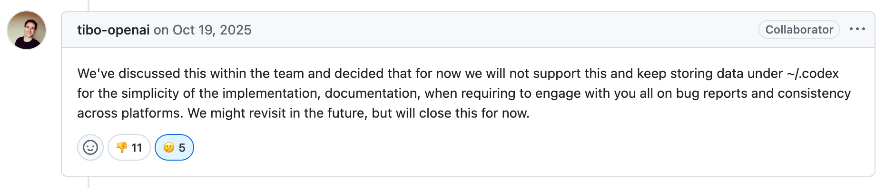
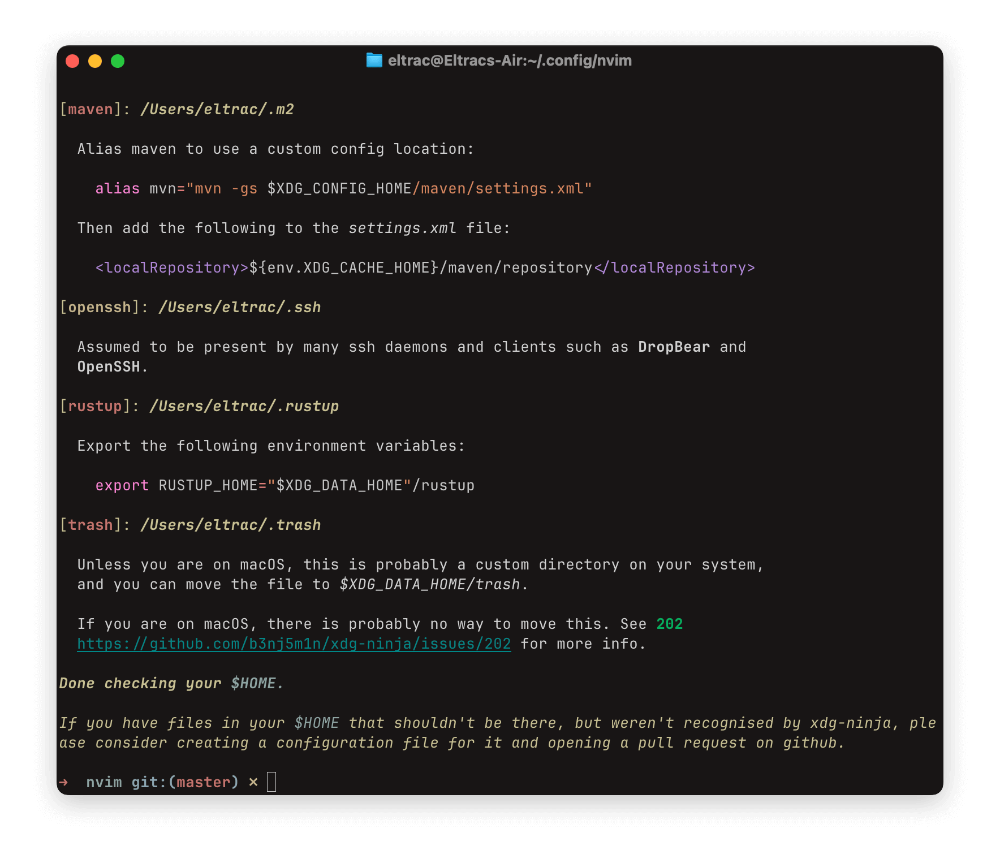

去年八月，我在少数派上读到了一篇题为《[码农的自我修养之保持干净的 $HOME 目录](https://sspai.com/post/101780)》的文章，从那个时候我就开始注意自己的 Home 目录。如果你不知道 Home 目录是什么：它是多用户操作系统中，系统为每个用户单独分配的目录，其中存放与该用户相关的文件，比如只为这一个用户安装的软件、下载文件、系统回收站、配置文件、数据文件和缓存等。

在类 Unix 系统下，可以用 `~` 表示当前用户的 Home，在终端执行 `cd ~` 就可以「回家」。Windows 系统下比较少提及 Home 目录，常见的是 `%APPDATA%`，这也是存放在用户的 Home 目录下的子目录。有不少操作系统有名为「文档」或 Documents 的用户目录，也是存放在 Home 目录里的。<!--more-->

Home 目录常被用来存放该用户的数据文件、配置文件和缓存文件，所有应用程序都可以进行读写。然而，不是所有用户程序都遵守规范（实际上也没有**强制**执行的使用 Home 目录的规范），有的软件会在「文档」而非 Home 目录下存储数据文件，有的软件会在 Home 根目录下创建多个点文件（dotfiles），有的软件相对守规矩，会把各种类型的文件都放在一个点目录里。不少操作系统默认的文件管理器都有提供 Home 目录的快捷方式，不少用户也会直接在 Home 目录下存储各种文件。

总而言之，如果不主动干预，Home 目录就会变得非常混乱。用户可以选择眼不见为净，毕竟点文件默认是隐藏的，不主动查看就难以发掘。如果你和我一样对自己的电脑有着奇怪的掌控欲，那我建议你继续读下去。

## 为什么要保持 Home 的整洁？

简单来说，混乱的 Home 目录会导致以下问题。

配置文件、数据文件和缓存文件没有分离。一般而言，配置文件和数据文件是用户需要保留的，即便更换设备，配置也可以迁移；配置文件往往是需要用户直接编辑的，而数据是操作软件时产生的，由软件读写；配置文件可以分享（例如 NvChad、LazyVim 等就是 NeoVim 的配置文件），而数据涉及到隐私，往往需要保护；缓存文件可以随时删除，不会影响软件正常运行[^1]。

我不太想把保持 Home 的整洁称作某种程序员应有的素养，因为这并不会让你的开发能力有任何提升，就像在中小学值日做清洁并不会让你的学习成绩有提升一样。让各种软件在同一个目录下打架并不会影响软件运行和日常工作，只是增加了管理成本——如果你完全不管理，那就无需在意了。

但如果你在意自己的数据，容忍这些文件乱作一团真的是件坏事。这和家政是一样的，如果你在意这件事情，那么容忍熵增只会让自己难受；如果不在意，以素养或责任一类的说辞裹挟自己也不利于自己的心理健康。

## 如何保持 Home 的整洁？

整洁就是「整」和「洁」——有条理，且没有杂质。还是用家政举例，我们把食物放在冰箱里，把衣物放在衣柜里，把书本放在书架里，物品有了各自的、确定的去处之后，它们就不会乱作一团了。在我们需要某种物品的时候，我们也能通过分类来快速定位。

分类其实不是件难事，真正困难的是处理人与人之间的矛盾。假设你喜欢把扫把放在阳台，而你的室友总是把它留在客厅，你大概就会对室友的行为感到不爽。现在请想象，你是一间公寓的房东，你的房子里住了很多人。出于某些原因，他们全都共享同一个空间。每个人对物品的分类标准都有所不同，把扫把放阳台还是客厅的争论肯定少不了，而你作为房东，大概也有自己的偏好，看到自己的房子被弄得乱七八糟，心里肯定也会觉得不舒服。到底有没有办法解决这个局面呢？

最简单的解决方式当然是设置统一的分类标准，强制要求大家都把扫把放在杂物间就好了。然而，计算机的世界要比合租更复杂一些。在前面的比喻里，房东是用户，租客是用户安装的软件，我们假设软件在哪里存放数据是能够自由更改的，并且一个软件只会存在于一个用户的电脑上。在计算机世界里，软件是可复制的，同样的软件会被分发给不同的用户，不同的用户可能有不同的存放数据的偏好。

单房东和多租客的情况下很容易达成共识，大家都听房东的话就好了。多房东和多租客的情况则复杂得多。假设房东告诉你应该把扫把放在阳台，二房东告诉你扫把要放在杂物间，而二房东的丈夫则要求你把扫把放在客厅，那你到底要听谁的？

作为租客，你需要考虑的其实只有「把东西放在该放的地方」这个问题，在这个比喻里，就是要「把扫把放在专门放扫把的地方」。现在的情况是这样的：

- 房东眼中的「专门放扫把的地方」 = 阳台
- 二房东眼中的「专门放扫把的地方」 = 杂物间
- 二房东的丈夫眼中的「专门放扫把的地方」 = 客厅

这些值表达的语义是相同的，但在不同的人眼里，实际的值是不同的。引用名相同，但是在不同的情况下赋值不同，这有让你想到什么东西吗？没错，就是「环境变量」。

现在我们脱离有关租房的比喻，回到计算机的世界来。如果程序员在开发时不武断地硬编码一个存放数据的文件路径，而是读取相关的环境变量，了解用户希望某种类型的数据文件应该被放在什么地方，前面提到的问题就迎刃而解了，而且，用户真正地掌控了自己数据的存放位置。

事实上，大部分程序员已经在这样做了。Home 目录的具体路径就是一个环境变量，这个变量一般由操作系统维护，赋值为当前用户的 Home 目录绝对路径。比如，在 macOS 下，如果以 `eltrac` 的身份登录，环境变量 `HOME` 的值就是 `/Users/eltrac/`。

但我们需要更进一步，因为现在的做法就和「应该把扫把放在家里」没有区别。有没有一个类似于现有的 `HOME` 目录的规范，让程序员能够分门别类地将不同的数据存放在用户通过环境变量指定的目录里呢？

## XDG 基本目录规范

XDG 基本目录规范（XDG Base Directory specification，缩写 XDG BDS）是由 Waldo Bastian、Allison Karlitskaya、Lennart Poettering 和 Johannes Löthberg 提出的。XDG 是 X Desktop Group，现名 freedesktop.org。名称中的 Free 指代的是「自由软件」的概念，这个项目致力于为自由软件桌面环境制定规范，让它们能够互通和共享基本技术。

如果你不清楚什么是「桌面环境」，请想象你的操作系统和你正在操作的桌面、图形界面和光标等元素是分离的，不是所有操作系统都有这些东西。桌面环境运行于操作系统之上，为用户提供图形界面，对于现代的个人电脑来说是必要的。Windows 和 macOS 和许多 Linux 发行版自带桌面环境，对于 Linux 这样的开源操作系统来说，用户可以自己选择桌面环境。我自己比较熟悉的是 KDE 和 Gnome。

文件系统并非是通过桌面环境实现的，所以看到 freedesktop.org 编撰这样一个规范，我是觉得有些奇怪的。不过细想也合理，毕竟如此在意文件整洁的人，可不就是喜欢折腾开源自由软件的桌面端 PC 用户嘛。

完整的规范可以在[这里](https://specifications.freedesktop.org/basedir/latest/)阅读全文，本文主要提及此规范为指定文件存储路径所规定的几个环境变量。这些定义有系统级和用户级的，由于我们在本文只讨论 Home 目录，固然只会涉及用户层级。此外，如果你还没有意识到——本文内容只适用于类 Unix 系统用户，也就是 macOS 用户和各大 Linux 发行版的用户。

- `XDG_CONFIG_HOME`：储存软件的配置文件。用户可以更改这些文件来调整软件行为；用户在更换设备之后也能迁移这些配置文件，在新设备上获得相同的软件体验。
- `XDG_CACHE_HOME`：不重要、可以被删除的数据，即缓存。
- `XDG_DATA_HOME`：持久的数据，是用户拥有的「内容」。假设你有一个遵循此规范的笔记软件，而你没有指定笔记的存储位置，它就可以默认把笔记写在这个位置。
- `XDG_STATE_HOME`：持久的数据，是软件的「状态」记录。假设你有一个遵循此规范的笔记软件，它可能会把编辑历史、窗口布局都软件在运行时产生的数据存放在这里。

用户层级下还有一个 `XDG_RUNTIME_DIR`，但默认情况下这个环境变量并不会指向 Home，大部分用户也不会用到它，本文就略过了。

对于用户来说，这样的划分使得 Home 目录更整齐了，与系统交互时也更省心——要更改配置，就在 `XDG_CONFIG_HOME` 找相应的文件；要清理缓存，就把 `XDG_CACHE_HOME` 目录下所有的文件都放心地删掉；要迁移或备份数据，直接操作 `XDG_DATA_HOME` 目录就好；至于 `XDG_STATE_HOME`，用户在大部分情况下不用管。

对于开发者来说，在读写文件时直接使用系统的环境变量很方便，例如 Go 语言提供了 `os.Getenv()` 方法访问环境变量。当然，不是所有的用户都设置了 XDG 环境变量，如果没有找到相关的环境变量，软件可以回退到直接在 `HOME` 目录下读写。

## 现实中的 XDG BDS

freedesktop.org 算不上什么权威组织，基本上只有使用 Linux 桌面系统的黑客才会在意 XDG BDS 规范，当然，如今也有不少 macOS 用户会关注 Home 目录是否整洁，但总体而言是比较小众的需求。XDG BDS 不像 RFC（Request for Comment）的一系列互联网技术规范，理应被严格遵守。它更像是一种观点、一个流派，没有人必须遵守，就像尽管提升柔韧度有助于避免运动受伤，也不是所有健身人士都注重拉伸。

开源、自由软件一般都会遵守目录规范，即便维护者本人没有这个意识，用户中的黑客也会有人提出建议或贡献代码，要求实现 XDG BDS。如果你使用的软件大部分都是自由软件，那你基本上不会遇到特别令人头疼的钉子户…… 不过，先让我们搞清楚什么是真正的自由软件。有不少软件有着自由的开源协议，但实际上是由某个公司开发的，不受开源社区控制。

我举一些我遇到的钉子户案例。

1. Logseq：设计和 org-mode 气质相似的大纲式笔记软件，算是我最喜欢的笔记软件。它是自由、开源软件（free and open-source），但是并不支持 XDG BDS。它实际上由 Logseq Inc 开发和运营。在 2021 年十二月，[@Hsins](https://github.com/hsins) 提交了 [Issue#3462](https://github.com/logseq/logseq/issues/3462)，提议遵循 XDG 规范，但直到现在，这个提议没有任何代码层面的进展。如果你现在安装 Logseq，它仍然会在你的 Home 目录下直接生成一个 `.logseq` 目录。
2. Claude Code：很受欢迎的 LLM 编码工具实际上是闭源的，现在他们的 GitHub 仓库里有 4.5k 个 Issues，其中有三四条和 XDG BDS 相关。相关的 Issues 几乎都没有收到开发者的回复。根据某条 Issue 的内容，Claude Code 的某个版本曾支持了 XDG BDS，但在后来的某个版本又撤回了这个更改。可以看出，Claude Code 开发团队里几乎没人在乎这个规范。现在，Claude Code 仍然肆无忌惮地在你的 Home 目录下生成三个乱七八糟的文件——`.claude` 目录、`.claude.json` 和 `.claude.json.backup`。
3. Codex：OpenAI 提供的类似于 Claude Code 的产品，也不支持 XDG BDS，但开发团队有直接回应：
    - 
    - 大概意思是，经过团队讨论，为了保证实现简单和各个平台的一致性，我们决定现在不支持这个规范。
4. Bun：很受欢迎的用 C++ 编写的 JavaScript 运行时和开发工具，速度很快，近期被 Anthropic 收购了。Bun 的 GitHub 仓库下有相关的 [Issue#1678](https://github.com/oven-sh/bun/issues/1678)，有很多提议和讨论，但仍然没有代码层面的实现。因为我无法忍受 Home 目录下有一个无法删除和移动的 `.bun` 目录，所以我仍然在使用 Node.js。
5. Maven：Java 的依赖管理器，会在 Home 目录下生成一个 `.m2` 目录存放依赖文件。嗯，我是不指望 Java 系的工具支持 XDG 规范的。所以在我完成了大学里所有 Java 相关的课程后，直接卸载了所有的 Java 开发工具。[^2]

简单来说，XDG BDS 的现状就是：它本身不是强制执行的规范，只是一种观点，不是所有软件都支持。对于闭源软件和商业软件，可能没有太多的操作空间，但是对于开源软件，还是可以通过提交反馈和直接提交代码来促进规范实现的。我最近在用又拍云的 CLI 工具 [upx](https://github.com/upyun/upx)，它就不支持 XDG BDS，代码是用 Go 语言写的，很亲切，与是我就自己实现了规范并提交了 Pull Request。就算他们不合并也没什么关系，因为我已经构建了支持 XDG BDS 的版本并替换了安装在我电脑里的二进制文件——这是开源软件的好处之一，如果有用着不习惯的地方，就可以自己 Fork 一份修改。

值得一提的是，有不少开源软件尽管没有直接实现 XDG BDS，但是有定义专用于这个软件的环境变量，用户可以自由指定数据文件的存储路径。比如 GNU PGP Guard 就会读取 `GNUPGHOME` 这个环境变量，如果读取到了用户自定义的值，就会把文件写在指定的位置。对于这样的软件，用户需要手动设置环境变量来支持 XDG BDS。以下是我的 `.zshrc` 文件中的一行。

```zsh
export GNUPGHOME="$XDG_DATA_HOME"/gnupg
```

综上，如果你想要通过 XDG 基本目录规范来整理你的 Home 目录和点文件，你需要做好以下心理准备：

* 你会遇到你无法改变的、不支持 XDG 规范的软件
* 你可能需要作为规范的推进者，向开源软件提交建议和贡献代码
* 你需要做很多额外的配置，甚至用歪门邪道调教软件，让它们把文件放在你想要的地方
* 你需要迁移现有的配置文件和数据文件

如果你准备好了，甚至觉得这很好玩，那我们就继续吧。

## 作为用户实现 XDG BDS

首先，你需要配置环境变量，先告诉那些本身就尊重 XDG BDS 的软件：我也遵循 XDG BDS，我希望你们把文件放在以下这些目录里。默认的、最简单的配置如下：

```zsh
export XDG_CONFIG_HOME="$HOME/.config"
export XDG_CACHE_HOME="$HOME/.cache"
export XDG_DATA_HOME="$HOME/.local/share"
export XDG_STATE_HOME="$HOME/.local/state"
export XDG_RUNTIME_DIR="/run/user/$UID"
```

你需要先知道你用的是什么 Shell（常见的有 zsh、bash 和 fish），你可以通过在终端输出环境变量 `SHELL` 来查看你所使用的 Shell 的二进制文件路径，这样一来就能确定你用的 Shell 是什么了。

```zsh
➜  ~ echo $SHELL
/bin/zsh
```

我用的是 zsh，接下来也使用 zsh 作为示范。

首先把上面的环境变量配置复制粘贴放在 `/etc/zshenv` 这个文件里，如果是其他 Shell，则需要自行查阅添加环境变量的位置。写在 `.zshrc` 这样的用户级配置里也是可以的，但 `.zshrc` 的默认存放位置是 `~/.zshrc`…… 是的，它本身就在 Home 目录下随意地摆着。如果你想把 `.zshrc` 也移动到它该待的地方（`~/.config/zsh/.zshrc`），你应该在系统级的配置下操作，因为 zsh 默认不会在符合 XDG BDS 规范的目录下查找配置文件。

在 `/etc/zshenv` 文件里写入以下内容：

```zsh
export XDG_CONFIG_HOME="$HOME/.config"
export XDG_CACHE_HOME="$HOME/.cache"
export XDG_DATA_HOME="$HOME/.local/share"
export XDG_STATE_HOME="$HOME/.local/state"
export XDG_RUNTIME_DIR="/run/user/$UID"

export ZDOTDIR="$XDG_CONFIG_HOME/zsh"
```

请注意我还在最后添加了一个 `ZDOTDIR`（Z Dot Directory）环境变量，这是为了告诉 zsh 把点文件放在 `XDG_CONFIG_HOME` 下，因为正如前文所提到的，zsh 不会读取 XDG 相关的环境变量。

接下来重启 Shell，尝试输出这些环境变量确认配置是否完成。

```zsh
➜  ~ echo $XDG_CONFIG_HOME
/Users/eltrac/.config
```

能正常输出就没有问题了，你已经完成了环境变量的配置。接下来，支持 XDG BDS 的软件就会自觉地把文件放在你指定的地方。根据我们的默认配置，这些位置分别是：

- 配置文件：`~/.config`
- 缓存文件：`~/.cache`
- 数据文件：`~/.local/share`
- 状态文件：`~/.local/state`

你可以随意修改，把数据放在你想要的位置，编辑环境变量即可。不过我偏好保留默认配置。

不过，你的 Home 目录还是和以前一样乱，因为支持 XDG BDS 的软件并不会自动帮你把原先的文件移动到环境变量里指定的位置，它们只是会优先在你指定的位置进行读写而已。然而，鱼龙混杂的软件中免不了有好几个不默认支持 XDG BDS、需要额外配置的软件，甚至有的完全不支持。如果贸然把所有的文件都迁移到 XDG BDS 目录下，会有大量的软件无法读取到原先的数据文件而出现问题。更致命的是，我的 Home 目录本来就很乱，我怎么分得清哪些是配置文件，哪些又是缓存和数据文件？

## Ninja to the rescue!

你可以安装 [xdg-ninja](https://github.com/b3nj5m1n/xdg-ninja) 这个命令行工具，它会扫描你的 Home 目录，列出他识别到的文件，给出配置、迁移指南和注意事项——哪些文件可以直接删除、哪些软件需要额外配置环境变量、哪些软件需要用到一些歪门邪道，全都罗列得很清楚。不过，xdg-ninja 也并非万能，如果你遇到没有识别到的目录或文件，可以考虑自行寻找解决方案后为 xdg-ninja 提交 Pull Request。



xdg-ninja 会引导你配置额外的环境变量，你可以放在系统级的 `/etc/zshenv` 里，也可以放在用户级的 `~/.config/zsh/.zshrc` 里。由于有不少开发环境和系统工具不会读取用户级配置，所以我的做法是把所有 XDG BDS 相关的配置都放在 `/etc/zshenv` 里。

记得每次更改之后都重启 Shell，也可以执行 `source /etc/zshenv` 或 `source ~/.config/zsh/.zshrc`。由于我频繁操作 zsh 配置，所以我写了一个命令行 alias：

```zsh
# Quickly edit zsh config
alias zshconf="nvim ~/.config/zsh/.zshrc && source ~/.config/zsh/.zshrc"
alias zshenv="sudo nvim /etc/zshenv && source /etc/zshenv"

```

在终端执行 `zshconf` 就可以用 NeoVim 打开用户级配置文件（用 `zshenv` 打开系统级配置文件），保存并退出之后就会执行 `source` 命令应用更改。

依照 xdg-ninja 的文档进行配置之后，就可以放心地把文件移动到它该待的地方了。这会花点工夫，而且不是一劳永逸的——如果有新的软件被安装，你可能还需要进行配置，不然 Home 又会随着时间推移而变乱。

至于那些不支持 XDG BDS 的软件，我的建议是提交 Issues 或贡献代码，推进规范的实现。如果是闭源软件，那…… 换成开源的替代品，嗯。我就把 Claude Code 换成了 [OpenCode](https://opencode.ai/)，好用，开放，还能让我的 Home 变干净。

---

这是我目前的 Home：

```text
/Users/eltrac
📁 .cache   📁 Applications  📁 Movies    ⚙️  .CFUserTextEncoding
📁 .config  📁 Desktop       📁 Music     ⚙️  .DS_Store
📁 .local   📁 Documents     📁 Pictures  🔗 .nix-profile
📁 .ssh     📁 Downloads     📁 Projects  📝 Brewfile
📁 .Trash   📁 Library       📁 Public
```

其中 `.Trash`、`.CFUserTextEncoding` 和 `.DS_Store` 是 macOS 在 Home 目录下生成的无法移除的文件，是 macOS 用户不得不接受的事实。除此之外，我对我现在的 Home 很满意。以及，我也会允许个别系统级工具在 Home 目录下占有一席之地。

[^1]: 其实还可以细分出更多的文件类型，比如状态数据和运行时文件，这里就略过了。

[^2]: 不过，这玩意好像很难彻底移除，我能不用 Java 开发，但我无法避免用 Java 编写的软件。在写这篇文章的前一天我开始折腾 Clojure（一门 Lisp 方言），结果发现 `.m2` 目录又回来了，里面装了一个 Clojure 的依赖……

