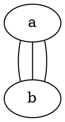
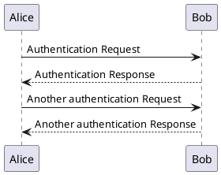

我极度厌恶拖拽式的图形界面，一方面是因为我最常使用的光标输入设备是 MacBook 自带的触控板，而众所周知用触控板拖拽简直是世界上最反人类的操作；另一方面，对于不少操作，图形界面都是不必要且更消耗资源的。开发者要构建图形界面，需要花更多的时间分析、设计和编码；电脑要运行图形界面，需要占用更多的系统资源；磁盘上存储图形数据，占用的空间也更高。诚然，图形界面的优势是简单直观、使用门槛低，但如果你有一个纯文本编辑器、习惯或愿意尝试使用命令行、乐意探索新技术，那么，我认为你至少应该尝试用纯文本的解决方案，替代原有的图形界面解决方案。<!--more-->

本文整理了几种在我看来使用纯文本解决要比使用图形界面解决来得更方便、更高效的问题场景，并给出了用到的相关软件，供读者参考。

## 绘图

作为软件工程的学生，画各种流程图、活动图、时序图和用例图应该是家常便饭。在软件工程里，表达需求的方式有很多种：自然语言描述、伪代码描述，还有图表。其中，图表自然是最清晰直观的，是必要的沟通工具。

在软件工程领域，各种类型的图表都有相应的规范。最常见的规范就是 UML，全称 Unified Modeling Language（统一建模语言），它提供了用图形描述软件系统架构、行为和需求的标准。

相关的绘图工具有很多，这里不谈国内外的各种 SaaS 软件[^1]，笔者在以前最长使用的是开源免费的 [draw.io](https://draw.io/)，基于 Web。使用这类基于图形界面的软件绘图的基本流程是：在左侧长长的列表中找到你需要的图形，然后把它拖拽到中间，点击它，把手指的位置从鼠标移动的键盘上，然后输入文本，然后把手指的位置从键盘移动到鼠标上，拖拽另一个图形到中间…… 在之后，你还要手动调整这些图形是否对齐、间距是否合适。

在这个过程中，有不少时间都浪费在了调整图形上，而不是用在「传达信息」上。而且，可供选择的图形种类很多，用户完全有可能用错图形，画出不符合 UML 规范的图。

有一段时间我会用自然语言描述需求，然后用 LLM 生成 SVG 代码来画图，但 LLM 的空间想象能力为 0，画出来的图歪七扭八，根本没法用。后来我发现，基于纯文本的画图解决方案其实不少。

### Mermaid

你可以把 [Mermaid](https://mermaid.js.org/) 想象成用来画图的 Markdown。要画一个简单的流程图（Flowchart），你只需要这样写：


Mermaid 的优势是，它和 Markdown 的生态系统兼容性很好，很多 Markdown 编辑器和渲染工具，都能够渲染嵌入在代码块里的 Mermaid 图形，你只需要把代码块的语言指定为 `mermaid`， 这个代码块就会被替换为图形。据我所知，Obsidian 是内置这个功能的，而 Hugo 的官方[文档](https://gohugo.io/content-management/diagrams/#mermaid-diagrams)里也提供了在 Hugo 中使用 Mermaid 的教程。

Mermaid 提供 [JavaScript 库](https://github.com/mermaid-js/mermaid)和[命令行工具](https://github.com/mermaid-js/mermaid-cli)，可以轻易地在网站上使用、在基于 Web 的桌面端软件里使用，或者在本地用纯文本编写，再执行 `mmdc` 命令将文本转换为指定格式的图形。

不过，我并没有继续使用 Mermaid，因为它有一个非常明显的缺陷：Mermaid 并不支持完整的 UML 规范。尽管 Mermaid 支持很多类型的图形（甚至包括思维导图、看板、饼图和四象限图），但缺少对用例图、活动图等重要 UML 图的支持。

顺带一提，早在 2023 年七月，就有一个相关的 [Issue](https://github.com/mermaid-js/mermaid/issues/4628) 被提出，建议添加用例图，有超过 600 点赞，呼声不小。也有 [Pull Request](https://github.com/mermaid-js/mermaid/pull/6141) 被提出，没有被合并[^3]，而且这个 PR 也没有完整实现规范的用例图，缺乏拓展、包含等关系的表示。Issue 的状态被标记为 Approved（通过），但用例图一直没有被添加到 Mermaid 中。Mermaid 上一次添加新的图表类型是在 [v11.0.0](https://github.com/mermaid-js/mermaid/releases/tag/v11.0.0) 版本[^2]，一年前。毕竟是开源项目，缺乏人手添加新功能也是可以理解的，而且 Mermaid 的定位是创建图表和可视化内容的，并非是对 UML 的实现。

### Graphviz

[Graphviz](https://graphviz.org/) 是上个世纪就出现的绘图软件，使用名为 DOT 的语言绘制节点、边、图、子图和组，支持命令行。Graphviz 的语法和 Mermaid 类似，但无需指定图表类型，因为 Graphviz 没有图表类型这个说法。个人感觉，Graphviz 中的 Graph 就是指数据结构中的图（graph），而不是图表（diagram）。



Graphviz 是用 C 写的，速度应该会比用 TypeScript 编写的 Mermaid 要更快，但不适合集成在 Web 应用中。如果需要表示数据结构，Graphviz 大概会更合适。

### PlantUML

[PlantUML](https://plantuml.com/) 基本上就是对 UML 的实现，支持时序图、用例图、类图、对象图、活动图等等。如果要画符合规范的 UML 图，PlantUML 几乎是最好的选择。除此之外，PlantUML 还支持不少非 UML 图，比如项目管理相关的甘特图和 WBS[^4] 图，还有数据库相关的 E-R 图[^5]。

PlantUML 的语法会稍微繁杂一点，~~原因大概是 PlantUML 是用 Java 写的，所以继承了编程语言的啰嗦特性~~，但整体上还算简单。以下是一个时序图的例子：



*Bob 和 Alice 简直是软件领域的李华。*

要使用 PlantUML，可以使用官方提供的[在线编辑器](https://www.plantuml.com/plantuml/uml/SyfFKj2rKt3CoKnELR1Io4ZDoSa70000)，也可以[下载](https://plantuml.com/download)到自己的电脑上，然后运行 JAR 文件——是的，你需要安装 Java……

```sh
java -jar plantuml.jar input.txt
```

我的建议是在 `.zshrc`（或者其他终端的配置文件里）给这个命令设置一个别名，这样就不需要每次都找到 JAR 文件在哪了。

PlantUML 也有相关的集成插件，可以在*万恶的* IntelliJ IDEA、VS Code 等编辑器中使用，也可以用在支持拓展语法的 Markdown 里。我自己最常用的场景是用 Pandoc 输入 Markdown 生成 PDF，可以使用这个 [pandoc-plantuml-filter](https://github.com/timofurrer/pandoc-plantuml-filter) 让 Pandoc 渲染通过代码块嵌入在 Markdown 文件中的 PlantUML 图。

## 富文本编辑

Word 简直是世界上最反人类的文本编辑器，还有与之相关的 Pages[^6] 和国内的 WPS——明明论文格式和各种文档都有固定的格式要求，我为什么会需要每写一篇文档都要手动调整格式，在各个菜单栏里点来点去？就算用格式刷我也觉得很难受！

### LaTeX

目前最成熟的文档标记语言应该是 [LaTeX](https://www.latex-project.org/)，这是一个免费软件。以下是 LaTeX 官网上引言的片段：

> LaTeX 不是一个文本处理器！相反，LaTeX 鼓励作者们不要太担心文档的外观，而是专注在编写正确的内容上。举个例子，考虑这篇文档：
> 
> ```text
> Cartesian closed categories and the price of eggs
> Jane Doe
> September 1994
> 
> Hello world!
> ```
> 
> 要在大部分排字或文本处理系统里产出这个文本，作者不得不决定使用什么排版，所以要选择（比如说）18 pt 大小的 Times Roman 字体用在标题上，12 pt 大小的 Times Italic 字体用在名字上，等等。这会导致两个结果：作者把时间浪费在了设计上；还有很多设计得不好的文档！

<details>
	<summary>原文</summary>
	
> LaTeX is not a word processor! Instead, LaTeX encourages authors not to worry too much about the appearance of their documents but to concentrate on getting the right content. For example, consider this document:
> 
> ```text
> Cartesian closed categories and the price of eggs
> Jane Doe
> September 1994
> 
> Hello world!
> ```
>
> To produce this in most typesetting or word-processing systems, the author would have to decide what layout to use, so would select (say) 18pt Times Roman for the title, 12pt Times Italic for the name, and so on. This has two results: authors wasting their time with designs; and a lot of badly designed documents!

</details>

使用 LaTeX 的话，就用纯文本这样写就好了。

```latex
\documentclass{article} 
\title{Cartesian closed categories and the price of eggs} 
\author{Jane Doe} 
\date{September 1994} 
\begin{document} 
	\maketitle 
	Hello world! 
\end{document}
```

不过，我并没有高强度的写论文需求，所以接触 LaTeX 比较少，用的比较多的场景应该是在 Markdown 中嵌入公式，许多 Markdown 编辑器都支持用 `$$` 包裹 LaTeX 块以渲染数学公式。以下是一个二分类问题的对数损失函数，用做示例。

```latex
$$
\mathcal{L}(\theta)
= -\sum_{i=1}^{n} \left[
y_i \log f_\theta(x_i)
+ (1 - y_i)\log\bigl(1 - f_\theta(x_i)\bigr)
\right]
$$
```


总而言之，LaTeX 是一个功能强大的文档标记语言，有了它就可以把注意力放在编写内容上，而无需过多关注页面排版。不过，也有人认为 LaTeX 的语法太啰嗦，所以会寻求其他的解决方案。

### Typst

你可以把 Typst 理解为一个更像 Markdown 的 LaTeX，它的功能和 LaTeX 一样强大，却有着 Markdown 一样简洁的语法。


Typst 支持各种类型的可视化、图表、数学公式、代码高亮等，还可以用来做幻灯片。Typst 本身是开源免费的，有提供云储存和同步的增值服务，可以订阅支持。不过，我没有使用过 Typst，所以就不展开了，我认为有较专业的论文写作需求的，可以尝试 Typst。

### Markdown 和 Pandoc

Markdown 最常用的使用场景是被渲染为 HTML，用在博客平台、论坛和一些即时通讯软件里（据我所知，Discord 就支持 Markdown 语法）。Markdown 的最大特点是可读性，即便没有被渲染，阅读纯文本的 Markdown 文档也没有任何问题。

尽管 Markdown 本身的语法比较局限，缺乏 LaTeX 和 Typst 的排版能力，但借助一些拓展语法和外部工具，就能让 Markdown 变得几乎万能。

本文要介绍的是一个非常强大的命令行工具——[Pandoc](https://pandoc.org/)，他几乎可以把任何文档格式转换为另一种文档格式（官网列出了详细的支持列表），它可以在 Markdown、Emacs Org-Mode、AsciiDoc、Typst、LaTeX、Microsoft Word 等格式之间相互转换，还可以把上述格式轻松转换为 PDF。如果有不支持的小众格式，还可以自己用 Lua 语言编写 Reader 和 Writer。

有了 Pandoc，你就可以安心地用 Markdown 编写文档，写完之后再转换为需要的格式，比如 Word 和 PDF。

你还可以编写 Filter 来拓展 Pandoc 的功能。Pandoc 转换文档的过程是这样的：使用相应的 Reader 把以原始格式编写的文档读取为 AST（抽象语法树，一个中间层）；再由 Writer 把 AST 写为用户指定的文档格式。编写自定义的 Reader 和 Writer 可以让 Pandoc 读取或写出更多的文档格式，编写 Filter 可以改变中间的抽象语法树。以下是 Pandoc 从输入到输出的过程：

```text
INPUT --reader--> AST --filter--> AST --writer--> OUTPUT
```

举个例子，如果你想要把 Markdown 文档里的二级标题全部替换为斜体正文内容，这就涉及到了更改中间层 AST，因为 `## 二级标题` 被 Reader 读取时，依然是二级标题，如果 AST 没有改变，被 Writer 写出的时候就转换为了另一个格式的二级标题（比如 HTML 的 `<h2>二级标题</h2>`）。如果要从二级标题改为斜体正文内容，就要在内容被 Writer 写出之前改变 AST 的内容。

记得前文提到的 PlantUML 吗？GitHub 上有一个现成的 [pandoc-plantuml-filter](https://github.com/timofurrer/pandoc-plantuml-filter)，他会把编程语言被标记为 `plantuml` 的代码块，用 PlantUML 渲染为对应的 UML 图——Reader 读取到了 `plantuml` 的代码块；Filter 把抽象语法树中的代码块变成了图片；Writer 把图片写入了输出文件。

配置好了对应的 Filter，就可以直接在 Markdown 文件里这样嵌入 UML 图：

~~~
```plantuml
Alice -> Bob: Authentication Request
Bob --> Alice: Authentication Response

Alice -> Bob: Another authentication Request
Alice <-- Bob: Another authentication Response
```
~~~

将 PDF 引擎设置为 `xelatex`，Pandoc 也能将被标记为 LaTeX 的代码块渲染为嵌入式的 LaTeX 文档，可以用这个特性来实现多图排版。

~~~
```{=latex}
\begin{figure}[H]
\centering
\begin{subfigure}[b]{0.3\textwidth}
  \centering
  \includegraphics[width=\textwidth]{img/1.jpeg}
  \caption{图 1}
  \label{fig:img1}
\end{subfigure}%
\hfill
\begin{subfigure}[b]{0.3\textwidth}
  \centering
  \includegraphics[width=\textwidth]{img/2.jpeg}
  \caption{图 2}
  \label{fig:img2}
\end{subfigure}%
\hfill
\begin{subfigure}[b]{0.3\textwidth}
  \centering
  \includegraphics[width=\textwidth]{img/3.jpeg}
  \caption{图 3}
  \label{fig:img3}
\end{subfigure}
\caption{三张图}
\end{figure}
```
~~~

有了上述工具，你就能以一种**工程化**的方式编写文档。我的建议是，把图片、参考资料、Markdown 源文件和其他资源放在同一个目录下，然后在这个目录下再创建一个 `pandoc.sh`，示例内容如下：

```sh
#!/bin/bash

pandoc "input.md" \
  --from=markdown+yaml_metadata_block \
  --pdf-engine=xelatex \
  --filter=pandoc-plantuml \
  -V geometry:margin=2cm \
  -V fontsize=12pt \
  -V mainfont="Songti SC" \
  -V CJKmainfont="Songti SC" \
  -o output.pdf
```

编写文档的过程中可能需要多次运行 Pandoc 来测试结果，或者在更新后生成更新版本的 PDF 文件，把命令放在 Shell 文件里更方便运行。这些设置项也可以放在 Markdown 文件的 frontmatter 里，具体放在哪里就看自己的喜好了。

```markdown
---
title: 文档标题
subtitle: 副标题
author: Eltrac
date: "2025-12-13"
geometry: margin=2cm
fontsize: 12pt
mainfont: "Songti SC"
CJKmainfont: "Songti SC"
header-includes:
  - \usepackage{xeCJK}
  - \setCJKmainfont{Songti SC}
  - \setCJKfamilyfont{hei}{Heiti SC}
  - ...
---
```

Pandoc 还可以一次性接收多个 Markdown 文件作为参数，文档也可以用模块化的方式编写。

```sh
pandoc intro.md chapter1.md chapter2.md appendix.md \
	-o output.pdf
```

如此一来，你就可以像开发软件系统一样编写文档，维护一个这样的目录：

```text
document/
├── intro.md
├── chapter1.md
├── chapter2.md
├── ...
├── appendix.md
├── pandoc.sh     <-- 编译时运行
├── img/
│   ├── figure1.png
│   └── ...
└── output.pdf    <-- 编译结果
```

把文档发送给别人的时候，提交 `output.pdf` 就好了。

### Quarto

[Quarto](https://github.com/quarto-dev/quarto-cli) 是一个基于 Pandoc 的命令行工具，可以用 Markdown 编写静态内容，也可以用 Python、R 语言、Julia 和 Observable 等技术生成动态内容，可以生成各种格式的博客文章、网站、幻灯片，以及 HTML、PDF、Word 和 ePub 等格式的电子书。

如果有更专业的写作和发布需求，比起用 Pandoc 自己搭框架，Quarto 可能是更成熟的选择。不过我没有用过这个工具，不清楚体验如何。

## 制作幻灯片

制作幻灯片（或者说演示文稿、PPT）的纯文本解决方案已经有很多，我比较熟悉的是 [sli.dev](https://sli.dev/)，可以用 Markdown 编写幻灯片。用纯文本做幻灯片的好处与编写文档类似，可以更专注内容而不是纠结格式问题。此外，Slidev 还提供内置的代码高亮，可以编写 Vue 组件放在幻灯片里，对开发者非常友好。我能想到的使用场景是，自己用 Vue 做了一个可运行的原型组件，比起截图，嵌入可交互的组件会更有表现力。

Slidev 本质上是提供了一种新的幻灯片形式，虽然可以导出为 PPT 和 PPTX 格式（甚至可以导出为单页应用），但最佳的效果还是在本地运行一个 Web 服务器做演示。所以，在需要提交 PPT 文件或者必须把 PPT 拷贝到其他设备里做演示的场景下，Slidev 可能没有那么好用。

此外，Obsidian 也自带幻灯片插件。被 Markdown 的水平分割线 `---` 分开的内容就会在幻灯片里被分成两页，没有拓展语法，可自定义的空间也比较小。如果能接受幻灯片里只有基础的文字和图片（甚至没有动画）的话，也不失为一种选择。不过 Obsidian 是不能导出 PPT 文件的。


我自己演讲的时候，比较依赖演示文稿的动画和稍微复杂一些的多栏排版，所以较少使用上述的纯文本解决方案。兴许以后可以尝试先用 Slidev 做出可用的原型，之后再使用 PowerPoint 或者 Keynote 添加动画。

---

## 为什么用纯文本？

### 可以使用 Git 做版本管理

如果一篇文档的编写周期很长，或者说需要多人协同编写，而参与者又都是会使用 Git 的开发者的话，使用纯文本的编写方案，就可以利用 Git 的版本管理能力管理文档的历史版本，上传到远程仓库后也就自带了多人协同能力。比起价格昂贵的多人办公 SaaS 软件，让本来就有 Git 使用经验的开发者使用自己习惯的编辑器协同编写文档，难道不是更高校更具性价比的选择吗？

任何用纯文本编写和储存的内容，都可以用 Git 管理。《[Just use cURL](https://justuse.org/curl/)》这篇文章表达了对 Postman 的鄙夷，作者认为把 cURL 命令放在 `.sh` 脚本文件里，就能够代替 Postman 的云端同步和团队协作功能。

> **Q：那团队协作怎么办？**
> 
> 这是个文本文件。把放进 Git 里。你知道吗，那就是那个你本来就应该在用的东西？现在你的 HTTP 请求有了版本管理、代码审查和差异对比。免费的。真是革命性的改变。

<details>
	<summary>原文</summary>
	
> **Q: What about team collaboration?**
> 
> A: It's a text file. Put it in Git. You know, that thing you should be using anyway? Now your requests have version control, code review, and diffs. For free. Revolutionary, I know.

</details>

如果你不喜欢 Git，那就去用 [Jujutsu](https://github.com/jj-vcs/jj)，或者别的什么你喜欢的版本管理工具。

### 拥有 100% 的数据掌控权

纯文本是开放的文件格式，任何设备都能读取纯文本格式。你的数据不会被强制储存在云端，不会有科技大厂分析或出售你的数据，你想把文件放在哪就放在哪。

### 文件体积小

PDF 文件和 PPT 文件的磁盘占用是 MB 级别的，简单的 PNG 图片往往有几百 KB，Word 文件的体积要小一些，但也没必要那么大。如果以上内容全部都用纯文本表示，只在必要时渲染成需要的格式，那么占用的磁盘空间将会非常小。如果和你协作的人也使用相同的技术将纯文本转换为 PDF 文稿或其他格式的文件，你们只需要通过网络传输 KB 级别的数据，文件只会在本地膨胀到 MB 级别，而且在工作完成之后，完全可以只保留原本的纯文本文件，删除结果文件。

这相当于下载软件时只拉取源代码和 Makefile（或者 Homebrew Formula），软件本体在本地编译，是很高效的选择。我注意到有不少人的 U 盘或移动硬盘里装着爆满的 Office 文件，如果全都换成纯文本，PPTX、DOCX、PDF 等文件在用过之后就直接删除，需要的时候再从纯文本中编译，那储存的成本将会降到非常低。

### 操作方便

精细复杂的图形可能没办法用纯文本解决（不然就跟前端工程师调试 CSS 一样难受了），但我相信日常工作中的不少操作都可以用纯文本简化。编写文本的过程中，手指完全不需要离开键盘操作鼠标，这对熟练使用键盘的人来说无疑提升了效率——如果你只需要敲五次键盘，打出 `A-->B` 这一行代码，为什么要在冗长的图形选择菜单里翻找自己需要的图形，然后拖拽到中间，然后把手指放到鼠标上点击图形，然后把手指放回键盘按下 `A`，然后…… 你应该明白我的意思了。

## 除了绘图、文稿和幻灯片，余下的一切

不要忘了，除了 Markdown，JSON、YAML 和 TOML 也都是开放的文本格式，这些格式能够表示几乎所有结构化的数据，只要有能够读取这些数据的软件，理论上，你可以用文本格式编辑任何东西、做任何操作，比如管理 DNS 记录。

你可以参考 [Sukka 的实践](https://blog.skk.moe/post/dns-as-code-via-dnscontrol/)，他使用 DNSControl 和 GitHub Actions 实现了用配置文件管理 DNS 记录的工作流，完全抛弃了各个服务商的用户体验参差不齐的 DNS 管理面板。以下

```javascript
D( 
	'skk.moe', REG_NONE, DnsProvider(DSP_VERCEL), 
	DefaultTTL(300), 
	
	ALIAS('@', 'skk.moe.cdn.cloudflare.net.', TTL(300)), 
	ALIAS('www', 'www.skk.moe.cdn.cloudflare.net.', TTL(300)), 
); 
```

*不过，把 JavaScript 代码说成是纯文本好像有点牵强呢……*

我在文章最后想要抛砖引玉一下：如果你遇到了一个比较复杂的需求，比起构建图形界面，先不妨思考一下是否有必要。如果你的目标用户都是熟练编写代码的黑客，纯文本、Markdown、JSON 甚至 JavaScript 和 Lua 等脚本语言，是比图形界面更好的选择。

[^1]: SaaS：Software as a Service（软件即服务），可以简单理解为商业软件，一般以订阅制为商业模式。

[^2]: 根据更新日志（"feat: Add packet diagram by @sidharthv96"），这个版本新增了报文图（Packet Diagram），用于表示计算机网络中报文或者说数据包的结构。

[^3]: 没有合并的原因是分支有冲突，而且 Pull Request 提出的时候，Mermaid 正好在把解析器从 jison 迁移到 langium，所以贡献者需要把原先写好的解析器迁移，额外的工作量可能劝退了他，总之这个 Pull Request 一年内都没了动静。

[^4]: WBS：Work Breakdown Structure（工作分解结构）

[^5]: E-R：Entity-Relationship（实体-关系）

[^6]: Pages 是苹果提供的 Office 软件，对标 Microsoft Word。
