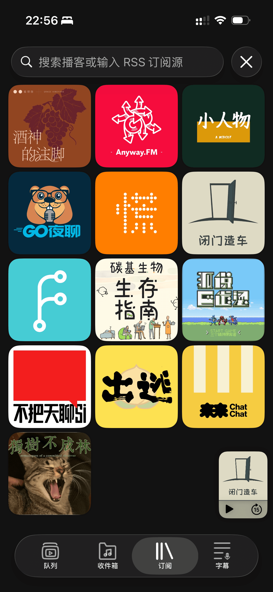
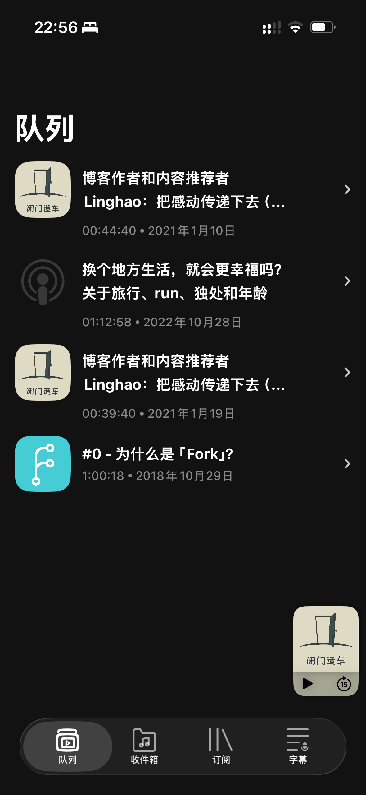



这首歌的名字意思是「天上在下男人」，嗯…… ~~希望是真的。~~

*It's Raining Men* 是美国 80 年代的热单，影响力似乎很大，现在在一些影视作品里也能见到。我印象最深刻的有两个，一个是《老友记》里 Chandler 的母亲作为跨性别角色第一次出场时，在拉斯维加斯表演的就是这首歌；另一次是《艾米丽在巴黎》第五季的骄傲月游行，Mindy 表演的就是这首歌的改编版。嗯，这首歌已经被酷儿群体拿去用了。
<!--more-->

---

又到周一啦，我得很不幸地告诉各位读者——我这周根本就没写周刊。怎么办呢？63 也不是个什么特殊的数字，总不能编一个「特别辑」出来糊弄读者吧？ *考拉沉思中……* 既然如此，那这期周刊就来写一写「我这周为什么没写周刊」吧。

嗯，是个不错的主题。

## 沉迷 NeoVim

根据 [WakaTime](https://wakatime.com/) 统计，过去七天我使用的编辑器只有 NeoVim。我记得我在周二就把除了 NeoVim 以外的所有编辑器卸载了，包括 Obsidian、[Zed](https://zed.dev/) 和 Trae（至于 Trae，本身就是我用来度过期末周临时安装的 AI IDE），因为我已经能用 NeoVim 替代它们了。

如果你感兴趣，可以查看我的 [NeoVim 配置](https://github.com/BigCoke233/nvim)。

## 折腾博客

如果你现在把页面拉到最下方，点开文章底部的 Webmention 区域，你可能会发现来自 Fediverse 的互动。现在博客和我的联邦宇宙账号联通了，这是通过 [Bridgy](https://brid.gy/) 实现的，这个服务会定期扫描我的 Fediverse 账号和我的博客，包含了博客某个页面链接的内容就会被视作这篇文章在 Fediverse 上的载体，Fediverse 居民的点赞和评论都会被抓取到，然后 Bridgy 就会把这些互动数据以 Webmention 的形式发送到我的博客。

博客一开始是使用 [webmention.js](https://github.com/PlaidWeb/webmention.js/) 展示数据的，很方便，但额外的 JavaScript 会拖慢网页加载速度，更何况还需要从 webmention.io 这个第三方服务拉取数据。这样做还有一个问题：我的数据没有存档，如果我打算更换 Webmention 接收器，这些数据无法保留下来，一直保存在 webmention.io 的数据库里。尽管 IndieWeb 上免费提供 Webmention 服务的不太可能是坏人，也不会对我的数据做什么，但我仍然希望数据能够尽可能存档在 Git 仓库里。于是，我编写了一个 Workflow，让 GitHub Actions 每隔三十分钟抓取一次 Webmention 数据，如果有就提交 commit，存放在 `data/webmention.json` 里，Hugo 在构建的时候可以自动读取这些数据。数据更新之后，因为提交了 commit，所以会触发 Cloudflare Workers 部署，新的数据就能被展示出来了。

所以，目前博客获取并展示 Webmention 的流程是这样的：

```text
webmention.io <-抓取数据- CI/CD -提交更改-> Git 仓库
                                ---部署---> Cloudflare Workers
```

如果你想试试，可以点击页面底部的「在 Fediverse 上互动」，点赞和评论都会在 30 分钟内被抓取并更新到这个页面里。

我还顺便把各种原本在构建时完成的数据提取工作都移动到了 CI/CD 里，比如构建[内部链接图谱](/graph)数据、提取[外部链接排行](/stats)和提取所有文章中的[高亮标记](/highlights)。

## 自建 Forgejo

Forgejo 是 Gitea 的分支，一个轻量级的 GitHub 开源替代品，目前主要用做备份，旨在拥有自己的数据。需要协作的场合还是会使用 GitHub，检索信息时也很难离开它。未来会配置 Forgejo Actions，把项目的 CI/CD 也迁移过去，至少这类基础设施要掌握在自己手上。

目前我把 Git commit 推送到远程仓库时，会同时推送到 GitHub 和 Forgejo 两个服务器上。

## 我正在重新审视自己的软件选择

本周五，也就是 1 月 9 日，我在 Telegram 频道「大脑充血」里发送了最后一条消息：

> 📢 Telegram 账号和频道的停用通知
>
> 本人正在逐渐转向去中心化网络，全面拥抱开源、自由软件。Telegram 本身是设计精良且注重隐私保护的闭源软件，但由于本人最近在 Fediverse（联邦宇宙）上更加活跃，而目前我也极少将 Telegram 当作通讯软件使用，主要用于阅览和发布频道信息，充当了更多的社交属性。显然，Fediverse 作为自由、去中心化的社交网络，对我而言，能比 Telegram 更好地满足需求。
>
> 再者，Telegram 会在人数较多的频道中投放广告，在最近的更新中还增加了 AI 功能，这是它作为一款商业软件无法摆脱的趋势，因此我决定全面停止使用 Telegram。从本消息发布开始，我不会在这个频道里发布新内容，几天后也不会继续回复私信或评论。
>
> 极客死亡计划等其他平台不会停止更新，你可以继续关注我的博客，或者在 Fediverse 上关注我：https://c7.io/@eltrac
> 如果你没有Fediverse账号也不打算使用去中心化社交媒体，你可以通过 RSS 订阅我的 Fediverse 账号：https://c7.io/@eltrac.rss
>
> 如果需要联系到我本人，可以使用一下联系方式：
>
> * 电子邮件： `hi@guhub.cn`
> * Matrix：`@eltrac:matrix.org`
>
> 希望我们最后都能在联邦宇宙，或者一个更开放的互联网上相见。

其实不只是 Telegram，我还停用了很多软件并找到了替代方案。

我卸载了 iPhone 上的小宇宙和 Apple Podcast。一开始不使用小宇宙是因为我抗拒它的社交功能和算法推荐，所以一直在使用苹果自带的 Podcast，但有不少中文博客并不能在 Apple Podcast 上找到。本周我发现，大部分播客节目其实有提供 RSS 订阅链接（小宇宙和喜马拉雅等平台都有提供），实际上使用 RSS 阅读器就能订阅节目更新。

*为什么不早说！*

我很快卸载了这两个 App，在 App Store 上找到了一个看起来比较轻量的播客播放器，叫作 Lightcast。支持 RSS 订阅和名称搜索，基本上我想听的播客都能搜到。我在[中文独立播客](https://typlog.com/podlist/)这个页面里找了一些新的感兴趣的播客订阅，现在应该是不缺好节目听了。








RSS 真的是伟大的发明。就这样，听播客这件事情也去中心化了。

我还卸载了我很早就看不惯的 WPS，无奈还是有在本地查阅和编辑办公文档的需求，尤其是放映幻灯片，投屏的时候如果使用 WPS 的 Web 版应用就要打开浏览器——无论怎么说，把自己的浏览器投屏给所有人看就是一件很恐怖的事情。我更偏好本地优先的解决方案。

照理来说，如果要选 FOSS 替代，应该用 LibreOffice，之前折腾 Manjaro 系统的时候也用过。不过，我之所以要用办公文档，主要是为了「兼容别人」，我自己是绝对不会主动编辑 Word、PPT 和 PDF 的，我是坚定的纯文本使用者。LibreOffice 对 Microsoft 办公套件的兼容性相对差一点，而且我一直觉得它的 UI 很丑。辗转过后，还是选择了商业软件 ONLYOFFICE，编辑体验与 WPS 和 Microsoft Office 几乎没有区别，而且启动速度比 WPS 快很多，界面也很友好。ONLYOFFICE 有提供社区的开源版本，所以也不算特别坏的选择。

*什么时候 Markdown 可以统治全世界？！*

上周我把输入法换成了开源的 [RIME](/posts/weekly/62/#rime)，整体而言，我正在逐步拥抱 FOSS[^1] 软件，也在逐渐把一些服务替换为自托管或者至少是去中心化的解决方案。这是我今年的目标之一，希望在年底我能完全脱离「大公司网络」，至少让他们在我的生活中降级到可有可无的位置。

以下是我的 MacBook 上安装的所有 GUI 软件，供读者参考。[^2]

```
○ Keka                         39.4MB
○ BetterDisplay                48.7MB
○ ONLYOFFICE.app               1.05GB
○ Squirrel                     87.2MB
○ 1Capture.app                 57.2MB
○ Calendr                      12.0MB
○ Googly Eyes.app               3.8MB
○ Hammerspoon                  40.3MB
○ LuLu.app                      8.6MB
○ Hidden Bar.app               23.3MB
○ NetNewsWire                  23.1MB
○ Raycast                     133.0MB
○ Dropover                     49.3MB
○ ChatGPT                     130.3MB
○ Helium                      305.3MB
○ Ghostty                      49.3MB
```


[^1]: Free and Open-Source Software，自由和开源软件

[^2]: 是的，我不在电脑上使用 QQ 和微信。
