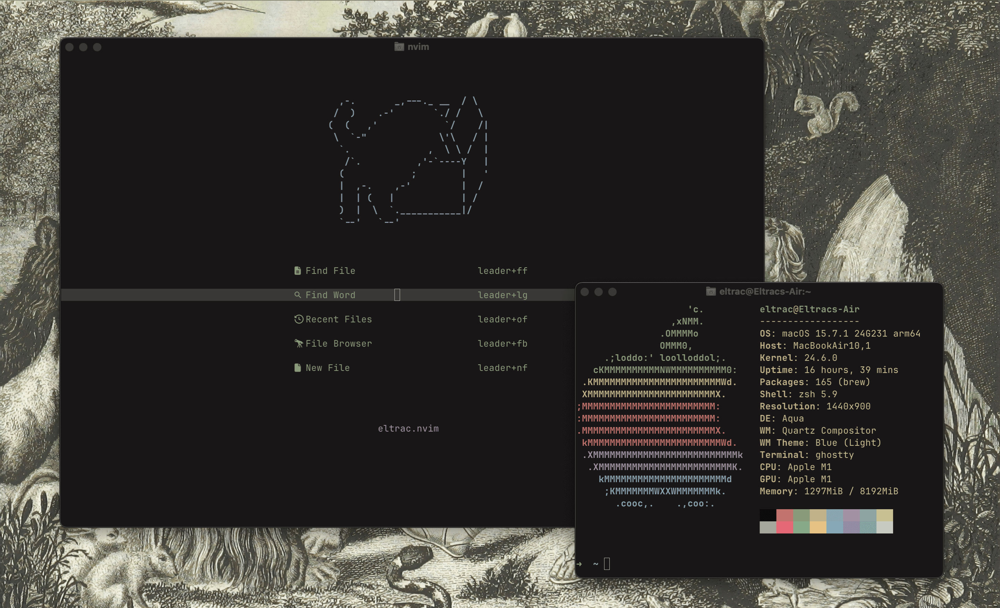

本页面响应 [uses.tech](https://uses.tech/) 的号召，罗列笔者使用的设备和软件，分享工作流和玩物体验。此页面会在未来移动到 [guhub.cn](https://www.guhub.cn/)，现临时存放于此。

## 硬件

### 设备

    

        
        <h4>MacBook Air (M1)</h4>
        
主力设备，开发和写作都用它，会被我背到各种地方，最常待的地方是我的大腿。

        
搭载 macOS 18

    

    

        
        <h4>Mac Mini (M4)</h4>
        
放在家里长期开机的电脑，最常见的使用场景是拿来看剧，未来可能会用来自托管应用。

        
搭载 macOS 26

    

    

        
        <h4>iPhone 15 Pro</h4>
        
就是一台正常的手机。

        
搭载 iOS 26

    

其他设备：

- iPad Air 5：全面转向纸质笔记之后，iPad 就变成我做运动时的媒体播放器了——如果我现在解锁它大概会看到一个薄肌体育生在带我做 HIIT，嗯……
- Kindle Paperwhite 5（2GB）：百来块买的二手 Kindle，喜欢读纸质书的我偶尔也会读一读电子书。这大概是我手上唯一一台充电口是 Micro USB 的设备了，这我也还能接受，由此可见我对设备的要求有多低。

过去使用过的设备：

- HUAWEI P40：~~很不幸地~~使用过三年的华为设备。
- HP Omen 9：一台有硬件问题的 Windows 游戏本。
- HP Inspiron：一台装载 Manjaro 系统的轻薄本，用它折腾了很多 Linux 相关的技术。目前转向了更稳定的 macOS，未来可能会继续使用 Linux PC。

### 配件

连接到 Mac Mini：

- ⌨️ Logitech MX Keys for mac
- 🖱 VXE R1 SE White
- 🖥 KOORUI P5（27 英寸 / 100Hz）[^1][^2]

连接到 MacBook：*Absolutely Nothing*

### 存储

*我的 MacBook 和 Mac Mini 都只有 256GB 的存储空间，而我只有一个用来存《老友记》全集的 1TB 的移动硬盘。我几乎没有任何硬性的存储需求，也完全没有存储焦虑。所以，这一节暂时还写不了什么。*

定期清理、严苛的软件筛选标准和数字极简主义是你最好的存储方案。

## 软件

### 包管理器

🍺 `Homebrew`

除了极个别只能够在 App Store 上获取的应用，我所有的软件几乎都通过 Homebrew 安装和管理。

🛠️ `MISE-EN-PLACE`

不错的开发工具管理器，编程语言的运行时和各种开发环境相关的工具都会通过 Mise 安装，可以替代 nvm 等特定的开发环境版本管理工具。值得一提的是，Mise 本身是通过 Homebrew 安装的。

🟧 `pnpm`

很好的 npm 替代，能够兼容 npm，并且不会在项目目录下生成<em>反重力</em> node_modules，速度也要快上不少。建议所有前端开发者使用。

### Mac Apps

- 浏览器：[Helium](https://helium.computer/)[^3]
- 终端模拟器：[Ghostty](https://ghostty.org/)
- RSS 阅读器：[NetNewsWire](https://netnewswire.com/)
- Email 客户端：Apple Mail（正在考虑换到 NeoMutt）
- 输入法：[RIME](https://rime.im/) + [雾凇拼音](https://github.com/iDvel/rime-ice)
- 压缩：[Keka](https://www.keka.io/)
- 启动器：[Raycast](http://raycast.com/)
- 截图：[1Capture](https://docs.1capture.com/)
- 办公文档：[ONLYOFFICE](https://www.onlyoffice.com/)[^4]
- 工具和优化
    - Googly Eyes：一个会盯着光标看的位于 Menu bar 的眼睛
    - Hidden Bar：[Bartendar](https://www.macbartender.com/) 的开源替代
    - [Hammerspoon](https://www.hammerspoon.org/)：编写 Lua 脚本与 macOS 系统交互，我用它实现这样一个需求——在我的 MacBook 接入外界显示屏时，把 Dock 栏固定到左侧。
    - Lulu：网络监控
    - Calendr：在 Menu bar 显示最近的日程
    - BetterDisplay：优化外接显示屏的显示效果
    - DropOver：优化 macOS 的拖拽体验
- 被逼无奈的选择：QQ 和微信。

### Web Apps

- Mastodon 客户端：[Phanpy](https://phanpy.social/)
- Matrix 客户端：[Cinny](https://cinny.in/)
- 在线办公文档：[金山文档](https://kdocs.cn/)

*希望有一天 Markdown 可以统治全世界，这样我就不用被 `.docx` `.pptx` 恶心了。*

### iOS Apps

- 运动健康：Gentler Streak
- 鼾声分析：AutoSnore
- 记账：MONO 记账
- 资产管理：Percento
- 音乐流媒体：Apple Music
- 播客：Apple Podcast / 小宇宙

### 编辑器

The one and only —— [NeoVim](https://neovim.io/)

你可以在[这个仓库](https://github.com/BigCoke233/nvim)查看我的 NeoVim 配置。我使用 [lazy.nvim](https://lazy.folke.io/) 管理插件。以下是一个预览：

## 服务

- Email：[Migadu](https://migadu.com/)，一家位于瑞士的观点鲜明的邮件服务商
- Git 远程仓库
    - [GitHub](https://github.com)，用于大部分需要协作的场合
    - 自建的 [Forgejo](https://src.guhub.cn) 实例，目前主要用于备份
- 去中心化的社交媒体：[c7.io](https://c7.io)（正在考虑自建）
- 去中心化的即时通讯：[matrix.org](https://matrix.org)（正在考虑自建）
- 去中心化的书影音：[NeoDB.social](https://neodb.social)

## 非电子

如果你在好奇为什么上面罗列的这么多软件里没有一个笔记软件，那是因为我的笔记都在这里：

关于这些笔记本各自的用途，我在这条[嘟文串](https://c7.io/@eltrac/115831903820014030)里有解释，未来也许会补充和整理到这个页面。

[^1]: 这个显示器也会被连接到 MacBook 上用作拓展屏。

[^2]: 是的，这里全都是便宜货，我没有很在乎配件。

[^3]: 顺带一提，我不会使用任何 AI 浏览器和需要登录注册才能使用的浏览器（没错，我说的就是 Arc）。

[^4]: 比 WPS 速度更快；比 LibreOffice 界面更友好。不过在我看来最好的选择是完全不碰这类格式
